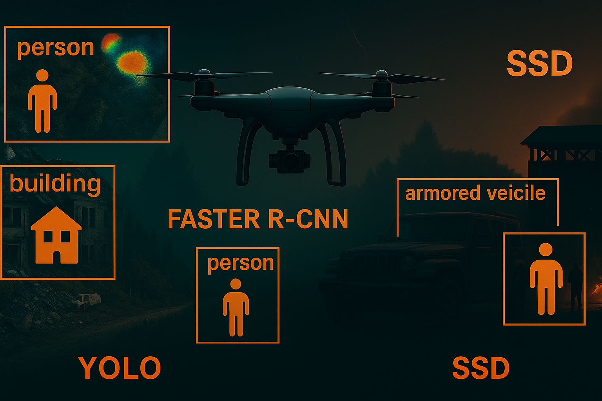

<!-- Project Banner -->
<p align="center">
  
</p>

<h1 align="center">📡 UAV Object Detection: YOLO vs Faster R-CNN vs SSD</h1>

<p align="center">
  <b>Real-Time Deep Learning-Based Object Detection for UAVs in Disaster and Military Scenarios</b>
</p>

<p align="center">
  
  
  
  
  
</p>

---

## 🔍 Overview

This repository hosts a comparative study of **YOLO**, **Faster R-CNN**, and **SSD** deep learning algorithms for **real-time object detection in UAV aerial imagery**. The project focuses on two key application areas:

- 🌪️ Disaster Management
- 🪖 Military Surveillance & ISR

> 🚧 **Note:** This project is currently in development and will be fully implemented in the coming days.

---

## 📂 Project Files

| 📄 File | 📋 Description |
|--------|----------------|
| `📘 Scientific research(Brief).pdf` | Concise summary version of the research, great for quick overviews. |
| `📗 Scientific research(Expanded).pdf` | Full research draft including all technical details and references. |

---

## 🚧 Project Roadmap

We are committed to completing this project in a structured and progressive way:

- [x] Literature Review ✅
- [x] Problem Identification & Scope ✅
- [ ] Dataset Collection & Preprocessing ⏳ *(In Progress)*
- [ ] Algorithm Implementation 🔜 *(Coming Days)*
- [ ] Model Training & Evaluation 🧪
- [ ] Comparative Analysis 📊
- [ ] Deployment & Recommendations 🚀

---

## 🧠 Research Highlights

### 🎯 Objectives
- Evaluate YOLO, Faster R-CNN, and SSD on real UAV data.
- Measure trade-offs: accuracy 🆚 speed 🆚 computation.
- Recommend the optimal algorithm for each scenario.

### ⚠️ Key Challenges
- **Small object detection** from high altitudes.
- **Real-time performance** on low-power UAV hardware.

---

## 🧪 Methodology Summary

- 📚 **Literature Review** of deep learning models for UAV vision.
- 🗂️ **Dataset** selection and annotation using aerial data (e.g., VisDrone, UAVDT).
- ⚙️ **Implementation** of models using PyTorch/TensorFlow.
- 📈 **Training and Evaluation** using metrics like mAP, FPS, precision/recall.
- 🧠 **Analysis** of which algorithm suits which mission profile.
- 🧭 **Future Work** in hybrid models and edge optimization.

---

## 💻 Sample Code (Coming Soon)

```python
# Placeholder for YOLOv5 model loading and inference
model = YOLOv5(weights="yolov5s.pt")
results = model("sample_uav_image.jpg")
results.show()
